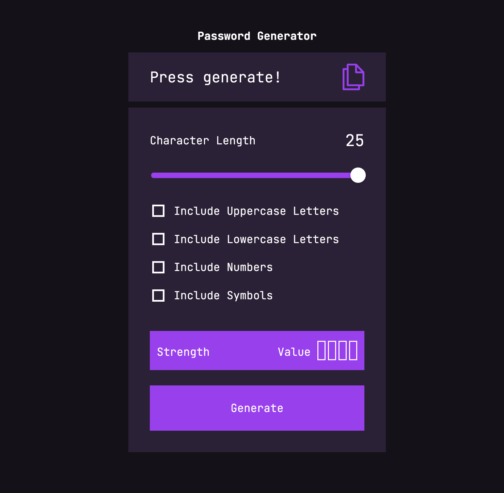

# 🔐 Password Generator

A sleek, modern, and responsive password generator built with HTML, CSS, and JavaScript. Users can customize the password length, choose which character types to include, check password strength in real-time, and copy it with a single click.



## ✨ Features

- Adjustable password length via an interactive slider  
- Toggle character types: uppercase, lowercase, numbers, and special characters  
- Dynamic slider color gradient based on password length  
- Real-time password strength indicator  
- Copy to clipboard functionality  
- Fully responsive design for all screen sizes  

## 🚀 Getting Started

### Live Preview

You can try the app by simply opening `index.html` in your browser.

### Run Locally

1. **Clone the repository**
   ```bash
   git clone https://github.com/edvinrunhellen/passwordGenerator.git
